# High Level Architecture

## 3.1: Technical Summary

Reality is a client-side heavy web application with serverless backend architecture, optimized for solo founder velocity and minimal operational overhead. The system uses Next.js 15 App Router for the frontend (deployed to Vercel), Supabase as the managed backend platform (PostgreSQL database + Edge Functions + Auth + Storage + Realtime), and Twilio for SMS/MMS capture integration.

The architecture follows a Jamstack + Serverless pattern where the Next.js app renders server components for SEO/performance, maintains client state via Zustand + TanStack Query, and delegates backend logic to stateless Supabase Edge Functions. Users capture moments via SMS (existing behavior), then organize on desktop web through a Google Maps-style interface with real-time updates powered by Supabase Realtime subscriptions.

Key integration points include: Twilio webhooks → Supabase Edge Functions for SMS ingestion, Mapbox GL JS for spatial visualization embedded in React components, OpenAI GPT-4 via Edge Functions for Pookie AI chat (keeps API keys hidden), and Supabase Storage for MMS photo management with server-side compression.

This architecture achieves PRD goals of <$35/month costs (Vercel free + Supabase $25 + Twilio $10), 6-8 week MVP timeline (managed services eliminate DevOps), and superior UX through desktop organization space vs mobile constraints.

## 3.2: Platform and Infrastructure Choice

**Platform:** Vercel (frontend) + Supabase (backend/database/auth/storage)

**Key Services:**
- **Vercel:** Next.js hosting, edge CDN, automatic deployments, preview URLs
- **Supabase PostgreSQL:** Primary database with Row Level Security (RLS)
- **Supabase Auth:** JWT-based authentication with email/password + Google OAuth
- **Supabase Storage:** MMS photo/video storage with CDN
- **Supabase Edge Functions:** Serverless Deno runtime for SMS webhook, AI calls, image processing
- **Supabase Realtime:** WebSocket subscriptions for live updates
- **Twilio Programmable SMS:** SMS/MMS webhook ingestion
- **Mapbox GL JS:** Map rendering and geocoding API
- **OpenAI GPT-4:** Pookie AI (called from Edge Functions)

**Deployment Host and Regions:**
- **Vercel:** Edge network (global automatic CDN), origin in US East (default)
- **Supabase:** US East 1 (primary region for database, can add read replicas later)
- **Twilio:** US phone number (+1), North America SMS routing

**Rationale:** Chose Vercel + Supabase (managed services) over AWS/self-hosted for developer velocity, zero DevOps overhead, and cost alignment with solo founder constraints. This is an opinionated "boring technology" choice that prioritizes shipping over infrastructure control.

## 3.3: Repository Structure

**Structure:** Monorepo (single repository containing all code)

**Monorepo Tool:** pnpm workspaces (lightweight, fast, already in use per PRD)

**Package Organization:**
```
reality/
├── apps/
│   ├── web/                    # Next.js 15 web application (PRIMARY)
│   └── mobile-archived/        # React Native code (REFERENCE ONLY, not built)
├── packages/
│   └── shared/                 # Shared TypeScript types, utilities
│       ├── src/types/          # Domain types (auth, experience, thought, desire)
│       ├── src/constants/      # Shared constants
│       └── src/utils/          # Shared validation, formatting utils
├── supabase/                   # Backend as code
│   ├── migrations/             # PostgreSQL schema migrations
│   ├── functions/              # Edge Functions (Deno)
│   └── config.toml             # Supabase local config
├── docs/                       # PRD, architecture, stories
├── .bmad-core/                 # BMAD agent system
└── scripts/                    # Build/deployment automation
```

**Rationale:**
- Single repo simplifies dependency management for solo founder (atomic commits across frontend/backend)
- pnpm workspaces already configured (no additional tooling complexity)
- Shared types package ensures type safety between Next.js and Edge Functions
- Supabase folder co-located for tight integration (migrations run alongside app development)
- Mobile archived but kept for reference (data models, lessons learned)

## 3.4: High Level Architecture Diagram

```mermaid
graph TB
    subgraph "User Entry Points"
        SMS[📱 User Phone<br/>SMS/MMS]
        WEB[💻 Desktop Browser<br/>Chrome/Firefox/Safari]
        MOBILE[📱 Mobile Browser<br/>iOS/Android]
    end

    subgraph "Vercel Edge Network"
        NEXTJS[⚡ Next.js 15 App<br/>React Server Components<br/>Client Components]
        CDN[🌐 Edge CDN<br/>Static Assets]
    end

    subgraph "Supabase Platform"
        AUTH[🔐 Supabase Auth<br/>JWT Sessions]
        DB[(🗄️ PostgreSQL<br/>RLS Policies)]
        STORAGE[📦 Storage<br/>Photo/Video CDN]
        REALTIME[⚡ Realtime<br/>WebSocket]
        EDGE[⚙️ Edge Functions<br/>Deno Runtime]
    end

    subgraph "External APIs"
        TWILIO[📞 Twilio<br/>SMS Webhook]
        MAPBOX[🗺️ Mapbox<br/>Maps + Geocoding]
        OPENAI[🤖 OpenAI<br/>GPT-4 API]
    end

    SMS -->|Webhook POST| TWILIO
    TWILIO -->|Inbound SMS| EDGE

    WEB --> NEXTJS
    MOBILE --> NEXTJS
    NEXTJS <-->|REST + Realtime| DB
    NEXTJS <-->|Sign up/Login| AUTH
    NEXTJS <-->|Photo URLs| STORAGE
    NEXTJS <-->|Live Updates| REALTIME
    NEXTJS -->|Embedded| MAPBOX

    EDGE -->|Insert Experiences| DB
    EDGE -->|Upload Photos| STORAGE
    EDGE -->|AI Chat| OPENAI
    EDGE -->|Reverse Geocode| MAPBOX

    CDN -->|Serve Static| WEB
    CDN -->|Serve Static| MOBILE

    style NEXTJS fill:#0ea5e9
    style DB fill:#3b82f6
    style EDGE fill:#8b5cf6
    style TWILIO fill:#f43f5e
```



## 3.5: Architectural Patterns

- **Jamstack Architecture:** Static generation + client-side rendering + serverless APIs - Optimal performance through pre-rendering, SEO-friendly, scales infinitely via CDN without managing servers
- **Serverless Functions Pattern:** Stateless Edge Functions for event-driven backend logic - Zero server management, automatic scaling, pay-per-use pricing aligns with MVP budget constraints
- **Component-Based UI:** Reusable React Server Components + Client Components with TypeScript - Next.js 15 App Router enables server-side rendering for performance while maintaining React's component model for maintainability
- **Repository Pattern:** Abstract data access through service layer (services/experiences.service.ts) - Isolates Supabase client calls, enables testing, provides migration path if switching databases later
- **Optimistic UI Updates:** Immediate local state updates with rollback on server error - Fast perceived performance for categorization actions, critical for desktop organization workflow feel
- **Real-time Subscriptions:** WebSocket-based live updates for new SMS captures - Users see captures appear instantly in Something's Abode without refresh, creates magical experience
- **API Gateway Pattern (Edge Functions):** Single entry point for external webhooks with routing logic - Centralized auth/validation for Twilio webhooks, keeps API keys hidden from client, enables rate limiting
- **Micro-Frontends (Lazy Loading):** Route-based code splitting for Map/Timeline/Heart views - Reduces initial bundle size, loads Mapbox/D3.js only when needed, critical for desktop performance
- **Database-as-Truth Pattern:** Server state managed by Supabase + TanStack Query caching - Eliminates complex local state sync logic, leverages React Query's built-in cache invalidation and refetching

---

