# Core Workflows

This section defines the key user journeys through Reality, showing how data flows from capture through organization to meaning-making via connections.

## 7.1: SMS Capture Flow

**User Goal:** Capture a moment via SMS/MMS without friction

**Flow:**

**Key Points:**
- Zero friction: User just texts normally
- Phone number identifies user (no login on phone)
- Media automatically uploaded and compressed
- GPS metadata extracted if available
- Experience lands in "abode" (inbox) by default
- Real-time notification to web app if user is online
- Entire flow completes in <2 seconds

**Error Handling:**
- Unknown phone number → Edge function responds with "Text SIGNUP to get started"
- Media too large → Compress before upload, warn user via SMS if >10MB original
- Geocoding fails → Store lat/lng only, location_name remains null
- Database insert fails → Retry once, then store in dead letter queue

---

## 7.2: Experience Organization Flow

**User Goal:** Organize captured experiences from inbox (Something's Abode) into categories (Heart/Mind/Body/Soul)

**Flow:**

**Key Points:**
- Optimistic updates for instant feedback
- Drag-and-drop interface for categorization
- Quality ratings added on-demand (not required)
- TanStack Query handles caching and invalidation
- All changes auto-saved (no explicit "Save" button)

**UI States:**
- Loading: Skeleton cards while fetching
- Empty: "Your abode is empty - go capture some moments!"
- Error: Retry button with error message
- Optimistic: Show new state immediately, rollback on error

---

## 7.3: Connection Creation Flow

**User Goal:** Create a connection between two entities to make meaning explicit

**Scenario:** Connecting an Experience to a Desire it fulfilled

```mermaid
sequenceDiagram
    participant User
    participant WebApp as Next.js Web App
    participant ConnectionModal as Connection Modal
    participant TanStack as TanStack Query
    participant API as Supabase REST API
    participant DB as PostgreSQL

    User->>WebApp: View Experience details page
    WebApp->>User: Show "Create Connection" button
    User->>WebApp: Click "Create Connection"

    WebApp->>ConnectionModal: Open modal
    ConnectionModal->>User: Show entity type selector
    User->>ConnectionModal: Select "Desire" as target

    ConnectionModal->>TanStack: useQuery('desires', {fulfilled: false})
    TanStack->>API: GET /desires?fulfilled=eq.false
    API->>DB: SELECT * FROM desires WHERE NOT fulfilled
    DB-->>API: [User's unfulfilled desires]
    API-->>TanStack: Response
    TanStack-->>ConnectionModal: Render desire list

    User->>ConnectionModal: Select "Learn piano" desire
    ConnectionModal->>User: Show relationship type selector
    User->>ConnectionModal: Type "fulfills" (autocomplete suggests)

    ConnectionModal->>User: Show meaning textarea
    User->>ConnectionModal: Write: "This first lesson fulfilled my desire to learn piano. The fear is gone."

    User->>ConnectionModal: Click "Create Connection"

    ConnectionModal->>TanStack: useMutation('createConnection')
    TanStack->>API: POST /connections<br/>{<br/>  from_entity_type: 'experience',<br/>  to_entity_type: 'desire',<br/>  from_experience_id,<br/>  to_desire_id,<br/>  relationship_type: 'fulfills',<br/>  meaning: '...',<br/>  strength: 10<br/>}
    API->>DB: INSERT INTO connections
    DB->>DB: Trigger: Increment lifetime_connection_count
    DB-->>API: Connection ID
    API-->>TanStack: Success

    TanStack->>WebApp: Invalidate 'connections' cache
    WebApp->>User: Show connection in graph visualization

    opt User wants to mark desire fulfilled
        User->>WebApp: Click "Mark desire fulfilled"
        WebApp->>TanStack: useMutation('updateDesire')
        TanStack->>API: PATCH /desires?id=eq.{id}<br/>{fulfilled: true, fulfilled_by_experience_id}
        API->>DB: UPDATE desires SET fulfilled=true
        DB->>DB: Trigger: Set fulfilled_at timestamp
        DB-->>API: Success
        API-->>TanStack: Updated desire
        WebApp->>User: Show celebration animation
    end
```

**Key Points:**
- Connection creation is guided (entity type → target → relationship → meaning)
- Autocomplete on relationship types from user's existing vocabulary
- Meaning field is the CORE - emphasized in UI
- Strength is optional (defaults to null)
- Connection graph updates immediately
- Optional: Mark desire fulfilled when creating fulfillment connection

**Connection Creation Variants:**
- **AI-suggested connections:** Pookie suggests → user reviews → accepts/edits/rejects
- **Quick connections:** From graph view, drag entity A onto entity B → auto-open modal
- **Bulk connections:** Select multiple entities → "Connect all to..." → batch create

---

## 7.4: Desire Fulfillment Flow

**User Goal:** Create a desire, break it into dependencies, fulfill them over time

**Flow:**

**Key Points:**
- Desires can be created standalone or with AI assistance
- Pookie AI suggests dependency breakdown
- Dependency graph visualizes what's blocking what
- Fulfilling dependencies unblocks parent desires
- Experiences can fulfill desires (creates meaning loop)

**Dependency States:**
- **Blocked:** Has unfulfilled dependencies (shown in gray)
- **Active:** No blocking dependencies, not yet fulfilled (shown in blue)
- **Fulfilled:** Marked complete, optionally linked to experience (shown in green)

---

## 7.5: Pookie AI Chat Flow

**User Goal:** Chat with Pookie AI to get insights, suggestions, and connection recommendations

**Flow:**

**Key Points:**
- Streaming responses for fast perceived performance
- Pookie has full context (experiences, thoughts, desires, connections)
- AI suggests connections based on conversation
- User can accept/reject/edit AI suggestions
- Chat history persisted in localStorage (not database for privacy)
- Pookie's suggestions improve as user's reality graph grows

**Pookie Capabilities:**
- Answer questions about patterns ("Why do I keep...?")
- Suggest connections between entities
- Break down desires into dependencies
- Reflect on emotional themes in experiences
- Help categorize experiences
- Identify blocking beliefs via thought analysis

---

## 7.6: Knowledge Graph Exploration Flow

**User Goal:** Visually explore the web of connections in their reality

**Flow:**

**Key Points:**
- D3.js force-directed graph for organic visualization
- Nodes colored by entity type (experiences blue, thoughts purple, desires orange)
- Edge thickness = connection strength
- Interactive: hover, click, drag, zoom, pan
- Detail panel shows entity details + connections list
- Can create new connections directly from graph
- Graph updates in real-time when connections added

**Graph Filtering:**
- Filter by entity type (show only experiences)
- Filter by category (show only "soul" experiences)
- Filter by date range (experiences in last 30 days)
- Filter by connection strength (only strong connections >7)
- Search nodes by text content

**Performance Optimizations:**
- Limit initial graph to 100 most recent/connected nodes
- Lazy load additional nodes on expansion ("Show more connections")
- Debounce force simulation updates
- Use canvas rendering for >500 nodes (instead of SVG)

---

## 7.7: Timeline View Flow

**User Goal:** View experiences chronologically on a timeline

**Flow:**

**Key Points:**
- Chronological visualization of life events
- Infinite scroll for loading older experiences
- Events positioned by `captured_at` timestamp
- Filter by category, quality score, tags
- Click event to view details
- Zoom controls (year/month/day view)

**Timeline Features:**
- **Density indicators:** Show clusters of high activity (many captures in short time)
- **Quality gradient:** Event markers colored by quality_score (dark to bright)
- **Connection lines:** Show connections between timeline events
- **Milestone markers:** Highlight desire fulfillments on timeline

---

## 7.8: Map View Flow

**User Goal:** View experiences spatially on a map

**Flow:**

**Key Points:**
- Mapbox GL JS for high-performance map rendering
- Markers colored by category, sized by quality_score
- Clustering for dense areas (many experiences in same location)
- Click marker for quick preview, double-click for details
- Optional: Draw connections between experiences on map
- Filter by category, date range, quality

**Map Interactions:**
- **Zoom:** Cluster markers at low zoom, individual at high zoom
- **Popup:** Click marker → show experience preview
- **Heatmap mode:** Show density of experiences (where you spend time)
- **Journey mode:** Connect experiences chronologically with paths

---

## 7.9: Workflow Summary

**The Complete Cycle:**

1. **Capture** (SMS Flow) → Experience lands in Something's Abode
2. **Organize** (Organization Flow) → Move to Heart/Mind/Body/Soul, add ratings
3. **Reflect** (Thought Creation) → Add thoughts on experiences/desires
4. **Connect** (Connection Flow) → Link experiences/thoughts/desires to create meaning
5. **Desire** (Desire Flow) → Create goals, break into dependencies, fulfill via experiences
6. **Explore** (Graph/Timeline/Map) → Navigate your reality spatially, temporally, relationally
7. **Insight** (Pookie Chat) → Get AI help understanding patterns and suggesting connections

**Each workflow feeds into the next, creating the infinite loop of meaning-making:**
- Experiences generate Thoughts
- Thoughts reveal Desires
- Desires drive action (outside system)
- Actions become Experiences
- Connections make all relationships explicit
- Understanding these connections IS solving the mind

---

